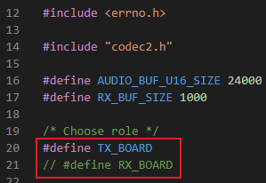
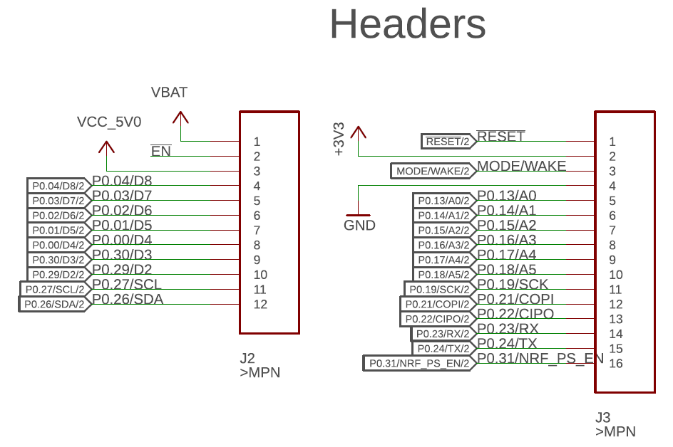
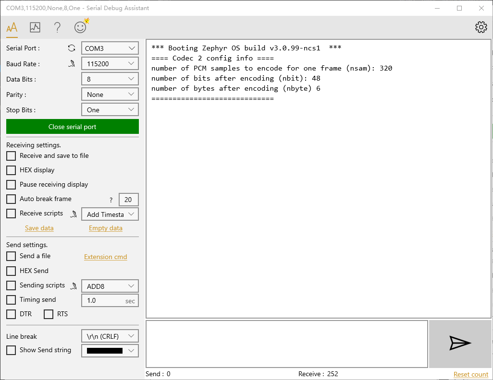
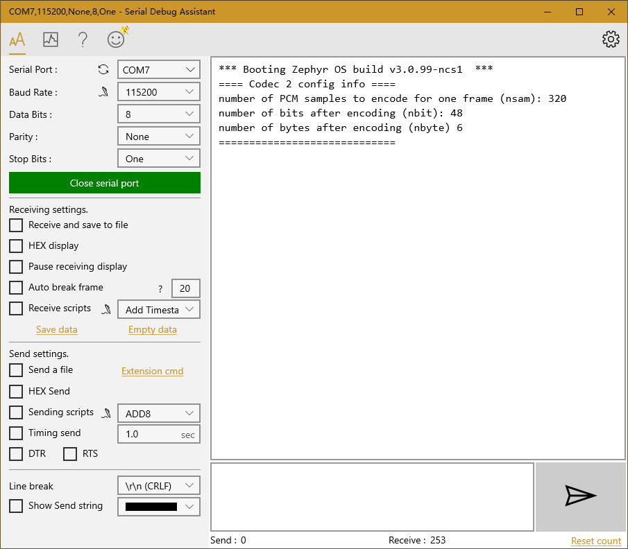
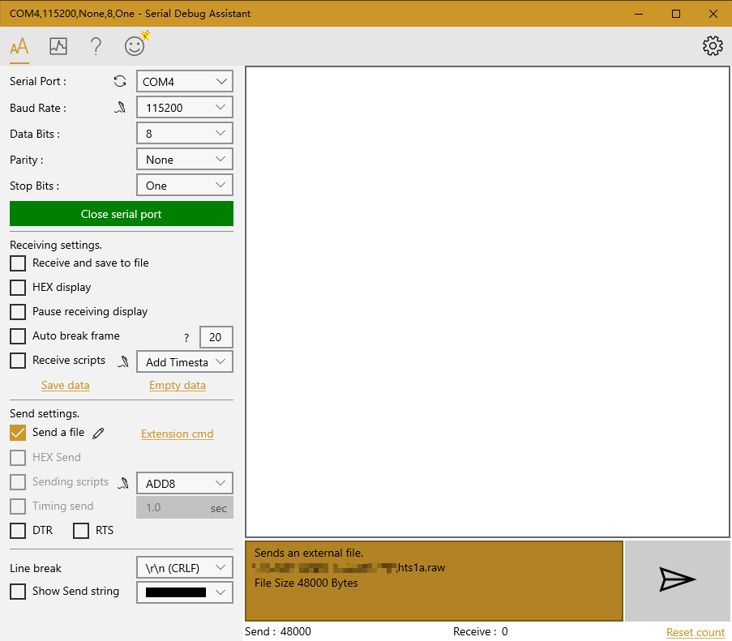
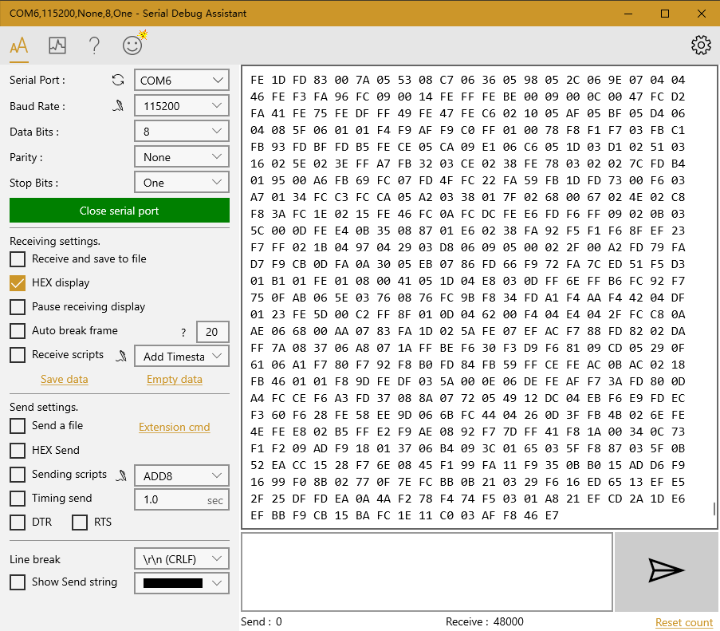
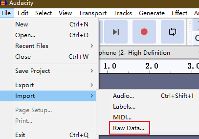
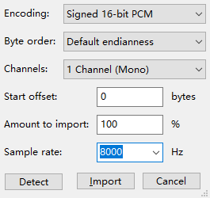

# Codec 2 on Zephyr Proof of Concept Project

## How to use this code

The project is tested on Windows 10.
### Hardware
- Two [nRF9160 Thing Plus](https://www.sparkfun.com/products/17354) boards.
- J-Link, for flashing application to the board and debug.
- Two UART-USB adapters.

### Software
- [串口调试助手 (Serial Debug Assistant)](https://www.microsoft.com/store/productId/9NBLGGH43HDM). Other serial port tools on PC are possible, but this tutorial uses the aforementioned tool.
- [HxD](https://mh-nexus.de/en/hxd/), a hex editor.
- [Audacity](https://www.audacityteam.org/), an audio process software.
- [nRF Connect for VS Code](https://nrfconnect.github.io/vscode-nrf-connect/index.html)

### Tutorial
Install the nRF Connect tools by following the [guide](https://nrfconnect.github.io/vscode-nrf-connect/connect/install.html). Import this project by the nRF Connect VS Code extension. Consult their guide for importing project.

#### Flash the Application
In `main.c` file, comment out one of ```TX_BOARD``` and ```RX_BOARD``` defines to make the board either a transmitter or a receiver (but of course, one board need to be TX and another one to be RX). Build and flash.  
  

#### Wiring
Each pin name printed on the nRF9160 board corresponds to a pin number, listed in the following figure. Pin number is used in the wiring tables.

  


|       |     Board    |   UART-USB adapter   |
|-------|--------------|----------------------|
| UART2 | TX: P0.24    | RX                   |
|       | RX: P0.23    | TX                   |


|       |     Board 1    |     Board 2    |
|-------|----------------|----------------|
| UART1 | TX: P0.00      | RX: P0.01      |
|       | RX: P0.01      | TX: P0.00      |

#### Transfer and Process Audio
The TX board will receive the original audio from PC, and use Codec 2 to encode the audio, then transmit the Codec 2 bits to the RX board.

The RX board will receive the Codec 2 bits from TX board, and decode the bits, then transmit the reconstructed audio to PC.

We use `hts1a.raw` as input audio. It is in 16-bit PCM format with 8000 Hz sampling rate.

Each board has two serial ports connected to PC:
- Type-C port: One for connection of the USB Type-C port on the board to the PC. This port is used by `printk` and log function for console output.
- UART2 port: Another one for the UART2 port connected to a UART-USB adapter, and finally connected to PC. For TX board, this one will receive the original audio from PC; for RX board, it sends the processed audio to PC.

##### Prepare the Serial Debug Assistant
For TX Board:
- Type-C port
    - Open Serial Debug Assistant, choose the correct `Serial Port`, set `Baud Rate` to `115200`.
    - Click `Open serail port`.
    - Push the reset button on the board, then some information will be printed out.
- UART2 port
    - Open Serial Debug Assistant, choose the correct `Serial Port`, set `Baud Rate` to `115200`.
    - Click `Open serail port`.
    - Check `Send a file`, then there is a window prompted to choose the file.

TX Board Type-C Port
  


For RX Board:
- Type-C port: same as TX Board.
- UART2 port:
    - Open Serial Debug Assistant, choose the correct `Serial Port`, set `Baud Rate` to `115200`.
    - Check `HEX display`.
    - Click `Open serail port`.

RX Board Type-C Port
  


##### Transfer Audio
In the Serial Debug Assistant window for TX board UART2 port, click the right lower "paper plane" icon, to start sending the original audio.

TX Board UART2 Port
  

After TX board received the whole audio, it encodes the audio and send Codec 2 bits to the RX board. After RX board receives all the Codec 2 bits, it decode and send the reconstructed audio to the PC by UART2 port.

Therefore, in the Serial Debug Assistant window for RX board UART2 port, many hex strings will appear. After the transmission stop, click `Save data`. There will be a window prompted to choose the file location. The data is saved as plain text (txt) file.

RX Board UART2 Port
  


#### Listen to the Processed Audio
Open HxD, create a new file (Ctrl+N), copy all the content in the txt file to HxD, save as a .raw file. Then we can play the audio.

Open Audacity, click `File->Import->Raw Data...`, choose the .raw file just saved. Change the sample rate to `8000`.

  

  


## nRF and Zephyr

## Reference
- [A slightly modified old version of Codec 2 for STM32F4](https://github.com/x893/codec2)
- [nRF9160 Schematic](https://cdn.sparkfun.com/assets/5/7/c/a/c/nRF9160_Thing_Plus.pdf)
- [Example audio](https://www.rowetel.com/downloads/codec2/hts1a.wav)