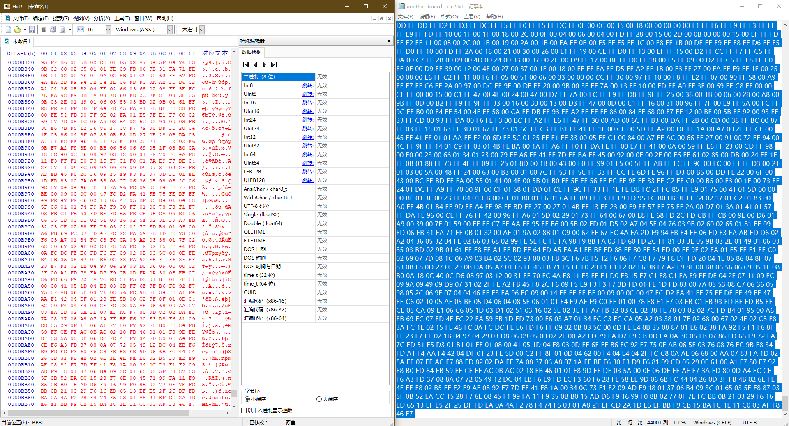
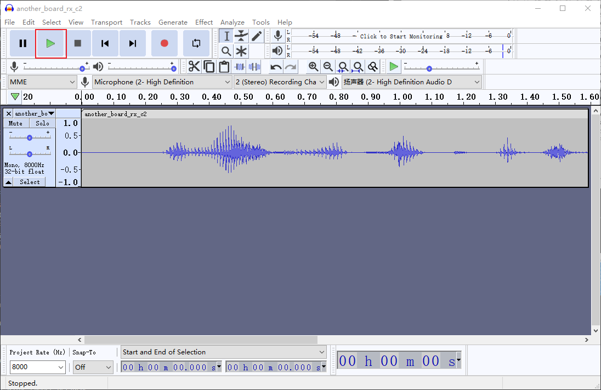
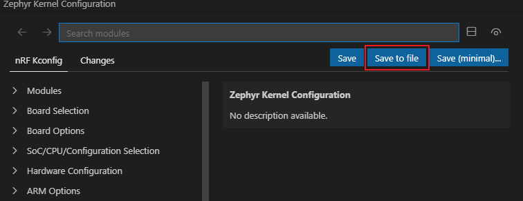
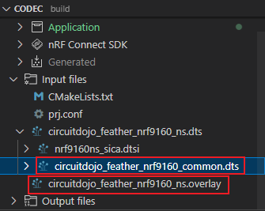

# Codec 2 on Zephyr Proof of Concept Project

## How to use this code

The project is tested on Windows 10.

### Hardware
- Two [nRF9160 Thing Plus](https://www.sparkfun.com/products/17354) boards.
- J-Link, for flashing application to the board and debug.
- Two UART-USB adapters.

### Software
- [串口调试助手 (Serial Debug Assistant)](https://www.microsoft.com/store/productId/9NBLGGH43HDM). Other serial port tools on PC are possible, but this tutorial uses the aforementioned tool.
- [HxD](https://mh-nexus.de/en/hxd/), a hex editor.
- [Audacity](https://www.audacityteam.org/), an audio process software.
- [nRF Connect for VS Code](https://nrfconnect.github.io/vscode-nrf-connect/index.html)

### Tutorial
Install the nRF Connect tools by following the [guide](https://nrfconnect.github.io/vscode-nrf-connect/connect/install.html). Import this project by the nRF Connect VS Code extension. Consult their guide for importing project.

(In case you need to select the board for creating new application, the board is `circuitdojo_feather_nrf9160_ns`.)

#### Flash the Application
In `main.c` file, comment out one of ```TX_BOARD``` and ```RX_BOARD``` defines to make the board either a transmitter or a receiver (but of course, one board need to be TX and another one to be RX). Build and flash.  
  

#### Wiring
Each pin name printed on the nRF9160 board corresponds to a pin number, listed in the following figure. Pin number is used in the wiring tables.

  


|       |     Board    |   UART-USB adapter   |
|-------|--------------|----------------------|
| UART2 | TX: P0.24    | RX                   |
|       | RX: P0.23    | TX                   |


|       |     Board 1    |     Board 2    |
|-------|----------------|----------------|
| UART1 | TX: P0.00      | RX: P0.01      |
|       | RX: P0.01      | TX: P0.00      |

#### Transfer and Process Audio
The TX board will receive the original audio from PC, and use Codec 2 to encode the audio, then transmit the Codec 2 bits to the RX board.

The RX board will receive the Codec 2 bits from TX board, and decode the bits, then transmit the reconstructed audio to PC.

We use `hts1a.raw` as input audio. It is in 16-bit PCM format with 8000 Hz sampling rate.

Each board has two serial ports connected to PC:
- Type-C port: One for connection of the USB Type-C port on the board to the PC. This port is used by `printk` and log function for console output.
- UART2 port: Another one for the UART2 port connected to a UART-USB adapter, and finally connected to PC. For TX board, this one will receive the original audio from PC; for RX board, it sends the processed audio to PC.

##### Prepare the Serial Debug Assistant
For TX Board:
- Type-C port
    - Open Serial Debug Assistant, choose the correct `Serial Port`, set `Baud Rate` to `115200`.
    - Click `Open serail port`.
    - Push the reset button on the board, then some information will be printed out.
- UART2 port
    - Open Serial Debug Assistant, choose the correct `Serial Port`, set `Baud Rate` to `115200`.
    - Click `Open serail port`.
    - Check `Send a file`, then there is a window prompted to choose the file.

TX Board Type-C Port
  


For RX Board:
- Type-C port: same as TX Board.
- UART2 port:
    - Open Serial Debug Assistant, choose the correct `Serial Port`, set `Baud Rate` to `115200`.
    - Check `HEX display`.
    - Click `Open serail port`.

RX Board Type-C Port
  


##### Transfer Audio
In the Serial Debug Assistant window for TX board UART2 port, click the right lower "paper plane" icon, to start sending the original audio.

TX Board UART2 Port
  

After TX board received the whole audio, it encodes the audio and send Codec 2 bits to the RX board. After RX board receives all the Codec 2 bits, it decode and send the reconstructed audio to the PC by UART2 port.

Therefore, in the Serial Debug Assistant window for RX board UART2 port, many hex strings will appear. After the transmission stop, click `Save data`. There will be a window prompted to choose the file location. The data is saved as plain text (txt) file.

RX Board UART2 Port
  


#### Listen to the Processed Audio
Open HxD, create a new file (Ctrl+N), copy all the content in the txt file to HxD, save as a .raw file. 

HxD and txt
  


Open Audacity, click `File->Import->Raw Data...`, choose the .raw file just saved. Change the sample rate to `8000`. Then we can play the audio.

  

  

  


## nRF and Zephyr
The nRF SDK currently DO NOT support UART 16-bit data transmission, functions in the name like `uart_xx_u16` won't work. Therefore, although the audio buffer is `uint16_t`, the data between transmission should use `uint8_t` type. So, always pay attention to the data size.

### Kconfig
When using the Kconfig of the nRF connect extension for VS code, use `Save to file` to permanently save the configuration in the `prj.conf`. If you use `Save`, it only saves to a temporary file and will be lost after build, and the change doesn't take effect.

  

### Overlay
In Details View, you can find the file `circuitdojo_feather_nrf9160_common.dts`, which contains all the peripheral settings.

When we want to change, for example, UART1, we need to write the configuration into an overlay file. If we didn't create it before, there will be a sign `No overlay files`. After click it, an empty overlay file will be generated.

  

  

### CMake
At the beginning I tried to include Codec 2 files to the application as a library, but ended with `Conflicting CPU architectures` error. I then tried to export the environment of zephyr and set those for Codec 2 library, but ended with `argument to '-O' should be a non-negative integer, 'g', 's' or 'fast'` error. However, it was very strange that as I saw from the command line the option with `-O` is valid.

Anyway, before I gave up, I tried to include Codec 2 as application source files, then it successfully compiled and linked.

### Some Useful Links
[Zephyr Device Tree](https://docs.zephyrproject.org/latest/build/dts/intro.html): I think the document is good to learn the device tree (with helpful knwoledge to configure the peripherals in overlay file), long documentation but most parts are understandable.

[Zephyr Example Projects](https://docs.zephyrproject.org/latest/samples/index.html): There is only description on each example page, but there is also a link to the GitHub repo so you can read the code.

[Zephyr API Documentation](https://docs.zephyrproject.org/latest/doxygen/html/index.html): Documentation of functions in Zephyr. The [asynchronous UART](https://docs.zephyrproject.org/latest/hardware/peripherals/uart.html#uart-async-api) part is especially helpful for this project.

[Error Numbers](https://docs.zephyrproject.org/apidoc/latest/group__system__errno.html): Good to know for debugging.


## Codec 2
To make the project build, I also commented out code about Codec 2 700 bps mode. It is possible to include that code, but for quickly make the whole system work, I chose to not bother that. Therefore, the supported Codec 2 rate is from 1200 bps to 3200 bps.

Other important changes are that where there is ```if(n)def ARM_MATH_CM4``` or ```if(n)def CORTEX_M4```, I added ```ARM_MATH_CM33``` and ```CORTEX_M33```. Especially, I added the code in `codec2_fft.h`:

```C
#ifdef ARM_MATH_CM33
  #include "nrf9160.h"
  #include "core_cm33.h"
  #include "arm_math.h"
  #include "arm_const_structs.h"
#endif
```

## Possible Improvement
Currently, the application transmitter role saves the whole input audio, whose duration is 3s, in memory. Then it encodes and also saves the Codec 2 bits in memory. Next, the transmitter sends the Codec 2 bits to the receiver. The receiver also save the whole encoded audio bits in memory, and then decode.

For semi-live or live audio (streaming), the above pattern is not feasible. We need to encode the audio once a frame (320 16-bit PCM data for 1200 bps, 160 16-bit PCM data for 3200 bps) comes in. Then transmit the Codec 2 bits while receiving the next frame.

The 8000 Hz sample rate means that 320 PCM data corresponds to 40 ms duration, and 160 PCM data corresponds to 20 ms. Moreover, these are the durations we can use to encode the frame. The UART can be set fast enough so that the transmission time can be omitted.

If in 1200 bps mode, the encoding time is longer than 40 ms, then semi-live or live stream is not possible. This then requires a faster clock frequency of the CPU.


## Reference
- [A slightly modified old version of Codec 2 for STM32F4](https://github.com/x893/codec2)
- [nRF9160 Schematic](https://cdn.sparkfun.com/assets/5/7/c/a/c/nRF9160_Thing_Plus.pdf)
- [Example audio](https://www.rowetel.com/downloads/codec2/hts1a.wav)
- [16 Bit UART support in Nordic SDK (v1.9.0) - Bus Fault error?](https://devzone.nordicsemi.com/f/nordic-q-a/84996/16-bit-uart-support-in-nordic-sdk-v1-9-0---bus-fault-error)